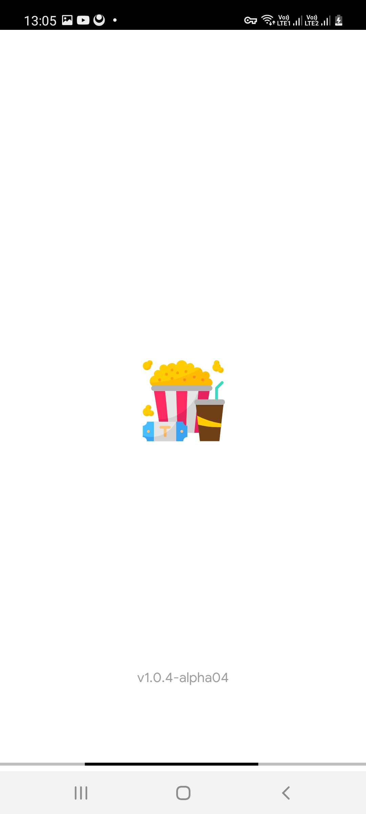

# TopCorn
**TopCorn** is a native Android app to fetch and browse through top movies from IMDB website
**TopCorn** is using the IMDB Api and it's built with Rxjava and the Retrofit library.

**TopCorn** has been developed using Android Studio and Java programming languate. It is utilising many fundamental Android SDK app development features and principals
# Screen Shot

